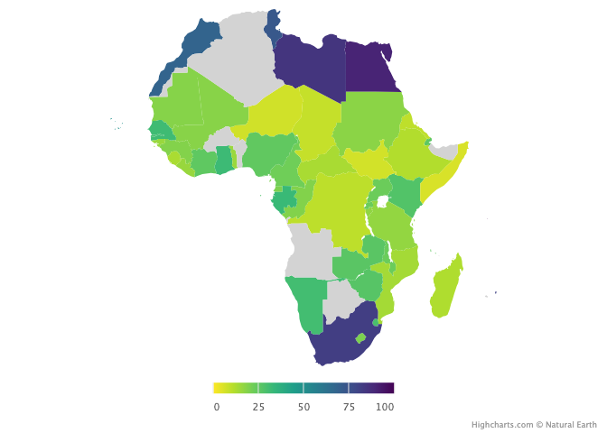

Visualizing some socio-economic Indicators
================

Visualizing socio-economic indicators is crucial for facilitating
comprehensive understanding and informed decision-making. Through visual
representation, complex data sets become more accessible and digestible,
enabling stakeholders, policymakers, and researchers to identify spatial
patterns, disparities, and trends across regions. Visualization enhances
communication by providing compelling insights into the status and
distribution of key indicators, thereby guiding resource allocation,
policy formulation, and targeted interventions aimed at addressing
socio-economic challenges and promoting sustainable development in
affected areas. Below are examples of some indicators for Africa.

## Africa Infrastructure Development Index

The development of infrastructure in Africa is vital for economic growth
and human development, and to reduce poverty while achieving the
Sustainable Development Goals (SDGs).

<!-- -->
